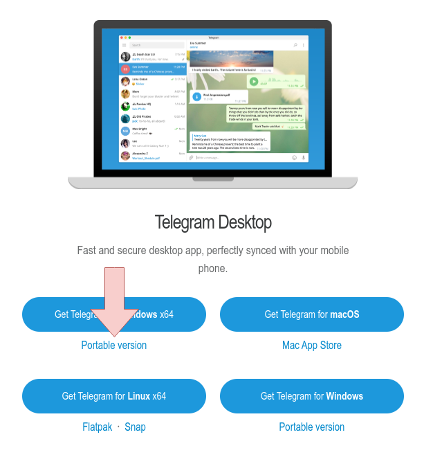

# okx-racer-rpa
Кликер для игры okx-racer в тг:   
[Запустить кликер](https://t.me/OKX_official_bot/OKX_Racer?startapp=linkCode_65748275)

## Инфо   
На компьютере с windows запущены несколько версий tg. Один раз в X секунд ищем на экране случайно выбранные кнопки `static/moon.png` или `static/doom.png` и кликаем на них всех по очереди.

## Установка проекта на Windows
0. [Установка git](https://git-scm.com/download/win/)    
1. [Установить python](https://docs.python.org/3/using/windows.html).    
2. [Скачать](https://desktop.telegram.org/) portable версию тг.     

3. Настройка рабочей среды.
    - 1 аккаунт = 1 папка, в каждую папку нужно закинуть копию portable телеги, запустить и залогиниться в тг.     
    - Переименовать .exe файл от телеги в соответствии с именем папки. 
    - Для каждого тг для удобства надо отключить уведомления и изменить размер интерфейса тг, чтобы больше вмещалось на пк (Настройки -> масштаб по умолчанию).    
4. Открыть cmd, перейти в папку куда хотим скачать проект.    
```
git clone https://github.com/aizavod/okx-racer-rpa.git
cd okx-racer-rpa
python3.12 -m venv venv
venv\Scripts\activate.bat
pip install -r requirements.txt
python rpa.py
```
5. Запустить телеги, запустить кликер, расставить на рабочем экране. (Если не кликается, то можно заменить кнопки в папке static `doom.png` и `moon.png`)


## Версии
Версия #2    
Июль, 2024